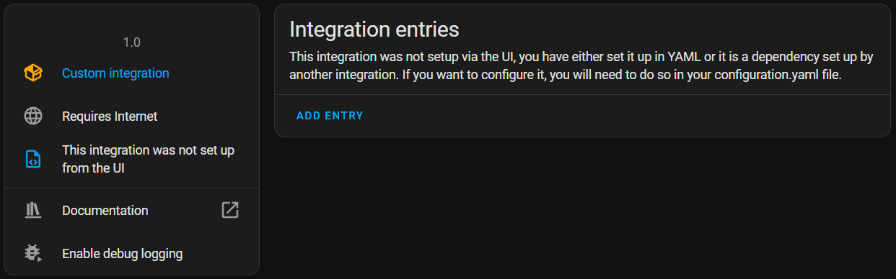
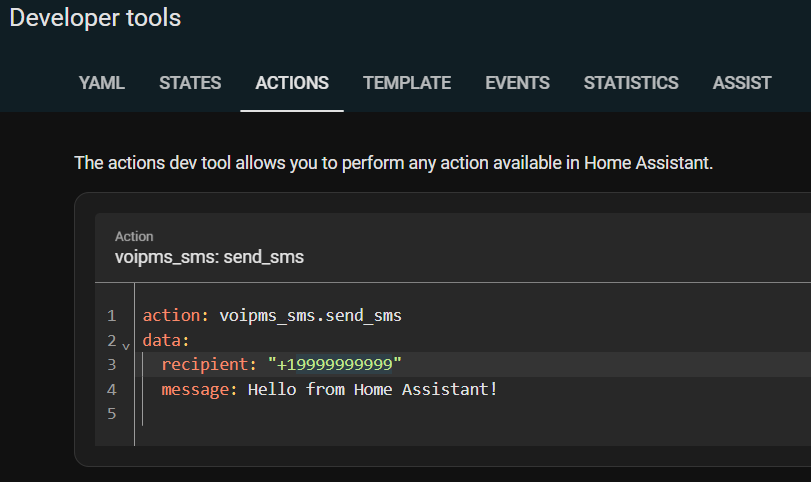
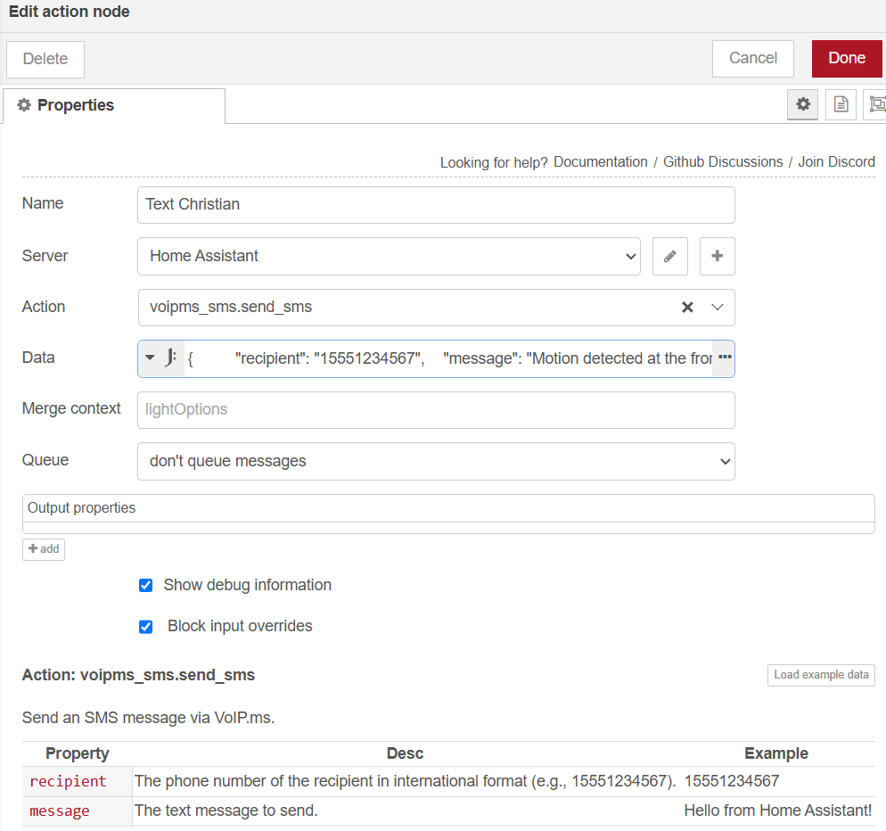

# ha-voipms_sms
Home Assistant custom integration for sending SMS (text) messages via Voip.ms REST Api 

## Prerequisites
- Voip.ms account with a DID that has SMS turned on
- API configuration set in the Voip.ms portal
  - API password set
  - API enabled
  - External IP address of your HA site, or DNS domain (sender whitelist)
  - Bearer token (optional, not needed for sending)
- Home Assistant running

## How to install the integration

Create a folder structure on your HA server and deploy the three files:

```
/config/custom_components/voipms_sms/
  ├── __init__.py
  ├── manifest.json
  ├── services.yaml
```  

Update `configuration.yml` and add the following section:

```
voipms_sms:
  account_user: "c@donners.com"
  api_password: !secret voipms_password
  sender_did: "9999999999"
```

Use your Voip.ms login email and the 10 digit DID phone number for the sender_did value, without punctuation.

Add the password secret to your `secrets.yml`:

```
voipms_password: "your_voipms_api_password"
```

Validate your configuration:

```
ha core check
```

Restart HA:

```
ha core restart
```

## Verify

Verify that that are no errors in the log from registering the service. 
Make sure that `VoIP.ms SMS` shows up iin the list of loaded integrations:




## Using the integration

To send a test message, navigate to `Developer Tools > Actions` in HA and enter your phone number in the recipient field:



If you do not receive a text message, consult your logs for errors.

You can use the service in flows, e.g. with Node Red as an Action node:

